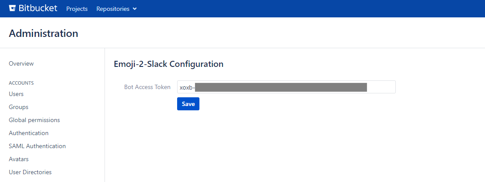
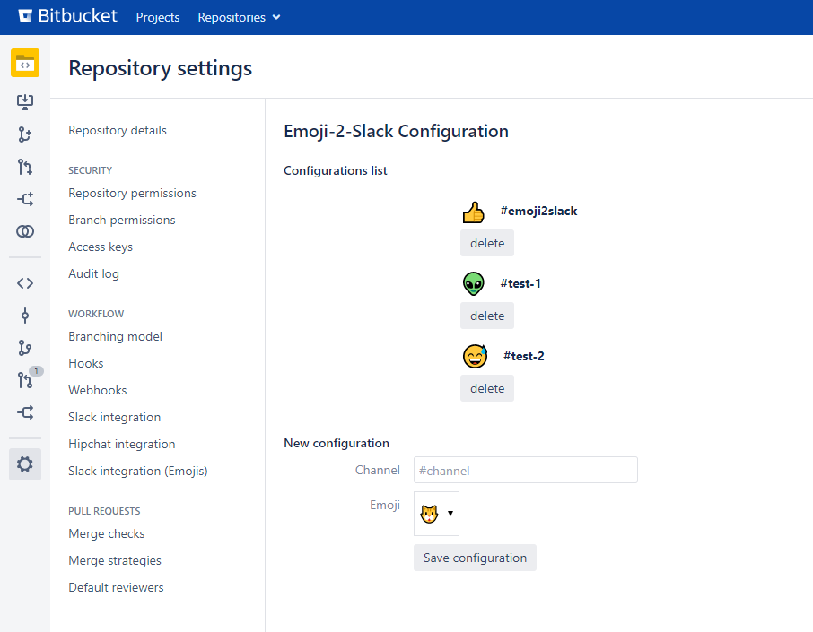

# Emoji2Slack Bitbucket plugin


<b>This plugin send messages to Slack when an emoji is used in comments in Bitbucket.</b>

1. Configure the token (xoxb-....) of a bot installed on your Slack channel in the global settings of the plugin
2. Link a emoji to a channel in a repository
3. Write a message on a PR containing the emoji, a message will be send to the channel configured 

## UI

### Global plugin configuration
You can configure the link to a bitbucket bot in the administration of Bitbucket
> Administration / Slack integration (Emojis)



### Pull request configurations
You can link a channel to a emoji on a specific repository
> Repository settings / Slack integration (Emojis)



## API

> [API description of Emoji2Slack in YAML (OpenAPI V3)](doc/swagger.yaml)

See specifications at https://github.com/OAI/OpenAPI-Specification and view with  https://editor.swagger.io/


## Webpages

Global configuration page
```
bitbucket/plugins/servlet/emoji2slack/settings
```

Repository configuration page
```
bitbucket/plugins/servlet/emoji2slack/project/{PROJECT}/{REPOSITORY}/settings
```

## Projects used

* [slack-client](https://github.com/HubSpot/slack-client)
* [vue-aui](https://spartez.github.io/vue-aui/#/)

## References

* [emoji-list on unicode.org](http://unicode.org/emoji/charts/full-emoji-list.html)